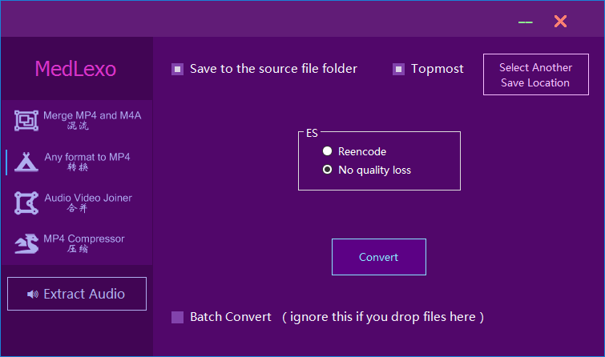

# Medlexo
| Version   | 9.7                              |
|-----------|----------------------------------|
| 32bit md5 | 9355A516E9CD78FDE12CE445B0AE7F0C |
| 64bit md5 | 76524DFDE8C4E0539210B65FBFF7AEB5 |
| Updated   | 22/6/2023                        |
| URL       | https://medlexo.is-an.app/       |

|   | Features                                    | 功能                          |
|---|---------------------------------------------|-------------------------------|
| 1 | [lossless] MP4 and M4A Merger               | [无损] MP4 和 M4A 混流/合并    |
| 2 | [lossless] .gif to .mp4 converter           | [无损] .gif 转 .mp4 格式转换器 |
| 3 | [lossless] .ts to .mp4 converter            | [无损] .ts 转 .mp4 格式转换器  |
| 4 | [lossless] Any file format to mp4 converter | [无损] 任何文件格式转mp4       |
| 5 | [lossless] Real Video Joiner                | [无损] 真•影片合并工具         |
| 6 | [lossless] m3u8 downloader                  | [无损] m3u8下载器             |
| 7 | ytdl                                        | ytdl                         |
| 8 | MP4 Compressor😍                           | MP4 压缩😍                   |
| 9 | [lossless] audio extractor                  | [无损] 提取音轨               |

